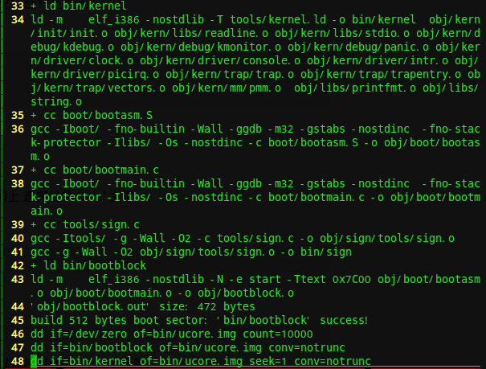

<h1 align = "center">UCORE_LAB1</h1>

###练习1
---
1.    <b>操作系统镜像文件ucore.img是如何一步一步生成的？（需要比较详细地解释Makefile中每一条相关命令和命令参数的含义，以及说明命令导致的结果）</b>
    
    >**step1.** 首先进入ucore的lab1目录，执行`make V=`命令，产生make.log文件
    >**step2.** `vim make.log`，如下图
   >
   >
   >
   >由46-48可知ucore.img由bootblock和kernel组成,由33,34行可知,kernel由一堆obj文件通过ld链接构成
   >**step3.** `vim Makefile` 如下图
   >
   >  
   >
   >第119行到153行生成kernel  
   >
   >  
   >
   >第153到170行生成bootblock,第170到176行生成sign
   >注意第165行
   >`$@(OBJCOPY) -S -O $(call objfile,bootblock) $(call outfile,bootblock)`表示拷贝二进制代码bootblock.o到bootblock.out
   >同时注意**make.log**的35-38行和42行，得到以下逻辑关系
   >```sequence  
   >                    bootblock.o  
   >                         |  
   >          -----------------------------------  
   >          |                                 |  
   >     bootasm.o                          bootmain.o  
   >          |                                 |  
   >     bootasm.S                          bootmain.c  
   >```
   >由第166可知由**bootblock.o**通过**sign**生成**bootblock**
   >具体内容我参考了lab1的参考答案

2.	<b>一个被系统认为是符合规范的硬盘主引导扇区的特征是什么？</b>
    >查看**sign.c**，`vim sign.c`
    >
    >注意31-32行，主引导扇区大小为512个字节，第510个字节为0x55，第511个字节为0xAA
    
###练习2
___
1.	<b>从CPU加电后执行的第一条指令开始，单步跟踪BIOS的执行</b>
    
   >参考了答案和网上的一些实现，修改Makefile，加入  
	```
	lab1: $(UCOREIMG)  
		$(V)$(TERMINAL) -e "$(QEMU) -S -s -d in_asm -D $(BINDIR)/q.log -monitor stdio -hda $< -serial null"  
		$(V)sleep2  
		$(V)$(TERMINAL) -e "gdb -q -x tools/lab1init"  
    ```
   >在tools文件夹下添加lab1init，内容为  
	```  
	#file obj/bootblock.o 代表gdb首先加载bootblock.o的符号表  
	file obj/bootblock.o  
	target remote: 1234  
	```
   >执行==`make lab1`==  
   >在qemu中执行==`x /2i $pc`== 如图  
   >  
   >qemu第一条指令是在0xfffffff0,但是我不知道为什么这时候qemu的  
   >第一条指令和gdb的第一条指令不同步  

2.	<b>在初始化位置0x7c00设置实地址断点,测试断点正常。</b>  
	
   >gdb在0x7c00处设置断点,continue一下,再查看指令,如图  
   >  
   >这时qemu和gdb在断点0x7c00处的指令同步,并且查看bootasm.S,其实就是执行的是bootasm.S中的指令序列  

3.  <b>从0x7c00开始跟踪代码运行,将单步跟踪反汇编得到的代码与bootasm.S和 bootblock.asm进行比较。</b>  
	
    >gdb中执行==`layout asm`== 如图 比较反汇编代码和bootasm.S的代码  
    >  
    >两者一致,最后是call bootmain  

4.  <b>自己找一个bootloader或内核中的代码位置，设置断点并进行测试。</b>  
	
	>==`file bin/kernel`==  
	>==`break kern_init`==  
	>  
	>在kern_init()处开始调试  

###练习3
___
1.  <b>请分析bootloader是如何完成从实模式进入保护模式的。</b>  
	
	>```asm
	>.global start  
	>start:  
	>.code16	#16位汇编模式  
	>	cli		#关中断  
	>	cld		#清除方向标志  
	>
	>#段寄存器ds,es,ss置零
	>	xorw %ax, %ax  
	>	movw %ax, %ds  
	>	movw %ax, %es  
	>	movw %ax, %ss  
	>#开启A20  
	>
	>seta20.1:  
	>	inb $0x64, %al	#从64端口读入一个字节到al  
	>	testb $0x2, %al	#检查第2位是否为1
	>	jnz seta20.1	#如果第2位为1,那么代表键盘缓冲区不空,循环检查  
	>	movb $d1, %al	#d1写入al  
	>	outb %al, $0x64 #al写入64端口  
	>seta20.2:  
	>	inb $0x64, %al	#从64端口读入一个字节到al  
	>	testb $0x2, %al	#检查第2位是否为1  
	>	jnz seta20.2	#如果第2位为1,那么代表键盘缓冲区不空,循环检查  
	>	movb $df, %al	#df写入al
	>	outb %al, $60	#al写入端口60
	>	
	>#载入全局描述符表基地址,cr0寄存器第0位置1,开启保护模式  
	>	lgdt gdtdesc  
	>	movl %cr0, %eax  
	>	orl $CR0_PE_ON, %eax  
	>	movl %eax, %cr0  
	>	
	>	ljmp $PROT_MODE_CSEG, $protcseg		#长跳转,此时已是保护模式  
	>	
	>.code32  
	>protcseg:  
	>#设置保护模式段寄存器值
	>	movw $PROT_MODE_dSEG, %ax  
	>	movw %ax, %ds  
	>	movw %ax, %es  
	>	movw %ax, %fs  
	>	movw %ax, %gs  
	>	movw %ax, %ss  
	>	
	>#设置栈指针
	>	movl $0x0, %ebp
	>	movl $start, %esp
	>	call bootmain
	>	
	>#如果从bootmain返回
	>spin:
	>	jmp spin  
	>	
	>#Bootstrap GDT  
	>.p2align 2  
	>gdt:  
	>	SEG_NULLASM  
	>	SEG_ASM(STA_X|STA_R, 0x0, 0xffffffff)	#代码段描述符  
	>	SEG_ASM(STA_W, 0x0, 0xffffffff)	#数据段描述符  
	>
	># 装载全局描述符的基地址和长度进入全局描述符表寄存器，注意加载的时候限长为0表示有1个长度的有效字节,限长23表示24个有效字节  
	>gdtdesc:  
	>	.word 0x17  
	>	.long gdt  
	>```

###练习4
___
1.	<b>bootloader如何读取硬盘扇区的?</b>  
2.	<b>bootloader是如何加载ELF格式的OS</b>  
	
	>打开bootmain.c,参考了网上的答案加上自己的理解,写了注释  
	>```c
	>	#define SECTSIZE 512	//一个扇区大小为512字节
	>	#define ELFHDR   ((struct elfhdr *)0x10000)	//地址0x10000为elf文件头部  
    >	/* waitdisk - wait for disk ready */  
	>	static void  
	>	waitdisk(void) {  
    >		while ((inb(0x1F7) & 0xC0) != 0x40)  
	>	//inb(0x1F7) & 000011000000 != 000001000000 判断1F7端口的第6,7bit是否为1,0  
	>	/* do nothing */;
	>	}  
	>```
	>
	>```c
	>/*读取一个扇区 扇区号为secno到指定地址dst*/  
	>/* readsect - read a single sector at @secno into @dst */  
	>	static void  
	>	readsect(void *dst, uint32_t secno) {  
    >	// wait for disk to be ready  
    >	waitdisk();  
	>	//1F2H　0号硬盘数据扇区计数  
    >	outb(0x1F2, 1);        // count = 1  
	>	//1F3H　0号硬盘扇区数  
    >	outb(0x1F3, secno & 0xFF);  
	>	//1F4H　0号硬盘柱面（低字节）  
    >	outb(0x1F4, (secno >> 8) & 0xFF);  
	>	//1F5H　0号硬盘柱面（高字节）  
    >	outb(0x1F5, (secno >> 16) & 0xFF);  
	>	//1F6H　0号硬盘驱动器/磁头寄存器  
    >	outb(0x1F6, ((secno >> 24) & 0xF) | 0xE0);  
    >	outb(0x1F7, 0x20);  // cmd 0x20 - read sectors  
	>
	>	// wait for disk to be ready  
    >	waitdisk();  
    >
	>	// read a sector  
	>	//insl 函数从0x1F0端口处读入4*(SECTSIZE / 4)个字节到dst处  
    >	insl(0x1F0, dst, SECTSIZE / 4);  
	>  }  
	>```

	>```c
	>	/* *  
 	>	* readseg - read @count bytes at @offset from kernel into virtual address @va,  
 	>	* might copy more than asked.  
	> 	* */  
	>	static void  
	>	readseg(uintptr_t va, uint32_t count, uint32_t offset) {  
	>	//读取的结束地址end_va = 起始地址va + count字节数  
    >	uintptr_t end_va = va + count;  
	>	// 因为从硬盘读数据是按扇区(512字节)的  
	>	//如果kernel文件的开始位置不是扇区的开头时  
	>	//因为我们要将kernel文件放入内存0x0001 0000处  
    >	// 所以要将扇区开头不是kernel文件的部分放入到0x0001 0000以前,  
    >	// round down to sector boundary  
    >	va -= offset % SECTSIZE;  
	>	//secno是读第几个扇区,因为第0扇区放bootloader,所以扇区数要加1  
    >	// translate from bytes to sectors; kernel starts at sector 1  
    >	uint32_t secno = (offset / SECTSIZE) + 1;  
    >	// If this is too slow, we could read lots of sectors at a time.
    >	// We'd write more to memory than asked, but it doesn't matter --
    >	// we load in increasing order.
    >	for (; va < end_va; va += SECTSIZE, secno ++) {  
        	readsect((void *)va, secno);  
    	 }  
	>  }  
	>```

	>```c
	>	/* bootmain - the entry of bootloader */  
	>	void  
	>	bootmain(void) {  
	>	//读取kernel从offset 0 开始的4k字节到地址0x10000处  
    >	// read the 1st page off disk  
    >	readseg((uintptr_t)ELFHDR, SECTSIZE * 8, 0);  

	>	//判断魔术  
    >	// is this a valid ELF?  
    >	if (ELFHDR->e_magic != ELF_MAGIC) {  
        	goto bad;  
    >	}  

    >	struct proghdr *ph, *eph;  

	>	//加载kernel的程序段  
    >	// load each program segment (ignores ph flags)  
    >	ph = (struct proghdr *)((uintptr_t)ELFHDR + ELFHDR->e_phoff);  
    >	eph = ph + ELFHDR->e_phnum;  
    >	for (; ph < eph; ph ++) {  
    >    	readseg(ph->p_va & 0xFFFFFF, ph->p_memsz, ph->p_offset);  
    >	}  

	>	//执行入口函数  
    >	// call the entry point from the ELF header  
    >	// note: does not return  
    >	((void (*)(void))(ELFHDR->e_entry & 0xFFFFFF))();  

	>	bad:  
    >		outw(0x8A00, 0x8A00);  
    >		outw(0x8A00, 0x8E00);  

    >	/* do nothing */  
    >	while (1);  
	> }  
	>```
	>**ELF**文件格式网上有很多这里不再赘述  

### 练习5	实现调用栈跟踪函数（需要编程）
___
1.	<b>在lab1中完成kdebug.c中函数print_stackframe的实现,可以通过函数print_stackframe来跟踪函数调用堆栈中记录的返回地址</b>  
	
    >函数调用堆栈如下  
    ><table><tr><td width="100" align="center">参数4</td></tr>  
    ><tr><td width="160" align="center">参数3</td></tr>  
    ><tr><td width="160" align="center">参数2</td></tr>  
    ><tr><td width="160" align="center">参数1</td></tr>  
    ><tr><td width="160" align="center">eip</td></tr>  
    ><tr><td width="160" align="center">caller's ebp</td></tr>  
    ><tr><td width="160" align="center">...(local arguments)</td></tr><table>  
    >以caller's ebp为基建一个帧  
    >```c
    >typedef strut c_frame{  
    >	uint32_t pre_ebp;  
    >	uint32_t eip;  
    >	int args[4];  
    >}c_frame;  
	>  
	>void  
	>print_stackframe(void) {  
    >/* LAB1 YOUR CODE : STEP 1 */
    >/* (1) call read_ebp() to get the value of ebp. the type is (uint32_t);  
    >* (2) call read_eip() to get the value of eip. the type is (uint32_t);  
    >* (3) from 0 .. STACKFRAME_DEPTH  
    >*    (3.1) printf value of ebp, eip  
    >*    (3.2) (uint32_t)calling arguments [0..4] = the contents in address (unit32_t)ebp +2 [0..4]  
    >*    (3.3) cprintf("\n");  
    >*    (3.4) call print_debuginfo(eip-1) to print the C calling function name and line number, etc.  
    >*    (3.5) popup a calling stackframe  
    >*    NOTICE: the calling funciton's return addr eip  = ss:[ebp+4]  
    >*    the calling funciton's ebp = ss:[ebp]  
    >*/  
    >uint32_t eip = read_eip();  
    >c_frame* fp;  
    >fp = (c_frame *)read_ebp();  
    >int i;  
    >for (i = 0; i < STACKFRAME_DEPTH && fp!= 0; i++){  
    >     cprintf("ebp:0x%08x eip:0x%08x args:0x%08x 0x%08x "\  
                  "0x%08x 0x%08x", (uint32_t)fp, eip,fp->args[0],fp->args[1], \  
                  fp->args[2], fp->args[3]);cprintf("\n");  
        print_debuginfo(eip-1);  
        eip = fp->eip;  
        fp = (c_frame *)fp->pre_ebp;  
    >}  
    >```  

###练习6
___
1.    <b>中断描述符表中一个表项占多少字节?其中哪几位代表中断处理函数的入口?</b>

    >查看mmu.h  
    >```c
    >struct gatedesc {
    >unsigned gd_off_15_0 : 16;        // low 16 bits of offset in segment  
    >unsigned gd_ss : 16;            // segment selector  
    >unsigned gd_args : 5;            // # args, 0 for interrupt/trap gates  
    >unsigned gd_rsv1 : 3;            // reserved(should be zero I guess)  
    >unsigned gd_type : 4;            // type(STS_{TG,IG32,TG32})  
    >unsigned gd_s : 1;                // must be 0 (system)  
    >unsigned gd_dpl : 2;            // descriptor(meaning new) privilege level  
    >unsigned gd_p : 1;                // Present  
    >unsigned gd_off_31_16 : 16;        // high bits of offset in segment  
    >};
    >```  
    >一共64位共8个字节，第0到15位和第48到63位表示段偏移量，16到31位表示段选择子  
    >这48位代表了中断处理函数入口  

2.    <b>请编程完善kern/trap/trap.c中对中断向量表进行初始化的函数idt_init。在idt_init函数中，依次对所有中断入口进行初始化。
    使用mmu.h中的SETGATE宏，填充idt数组内容。每个中断的入口由tools/vectors.c生成，使用trap.c中声明的vectors数组即可</b>
    
    >```c
    >void
    >idt_init(void) {
    > /* LAB1 YOUR CODE : STEP 2 */
    > /* (1) Where are the entry addrs of each Interrupt Service Routine (ISR)?
    >  *     All ISR's entry addrs are stored in __vectors. where is uintptr_t __vectors[] ?
    >  *     __vectors[] is in kern/trap/vector.S which is produced by tools/vector.c
    >  *     (try "make" command in lab1, then you will find vector.S in kern/trap DIR)
    >  *     You can use  "extern uintptr_t __vectors[];" to define this extern variable which will be used later.
    >  * (2) Now you should setup the entries of ISR in Interrupt Description Table (IDT).
    >  *     Can you see idt[256] in this file? Yes, it's IDT! you can use SETGATE macro to setup each item of IDT
    >  * (3) After setup the contents of IDT, you will let CPU know where is the IDT by using 'lidt' instruction.
    >  *     You don't know the meaning of this instruction? just google it! and check the libs/x86.h to know more.
    >  *     Notice: the argument of lidt is idt_pd. try to find it!
    >  */
    >extern uintptr_t __vectors[];
    >int i;
    >for (i = 0; i < 256; ++i) {
    >    SETGATE(idt[i],0,GD_KTEXT,__vectors[i],DPL_KERNEL);
    >}
    >SETGATE(idt[T_SYSCALL],1,GD_KTEXT,__vectors[T_SYSCALL],DPL_USER);
    >SETGATE(idt[T_SWITCH_TOK],0,GD_KTEXT,__vectors[T_SWITCH_TOK],DPL_USER);
    >lidt(&idt_pd);
    >}
    >```
    >中断描述符表idt，每个表项的处理函数入口地址位__vectors[i]，查看vector.S，共有256个vector，0-255，__vectors[i]表示vectori的地址
    >除了系统调用中断(T_SYSCALL)使用陷阱门描述符且权限为用户态权限以外，其它中断均使用特权级(DPL)为０的中断门描述符，权限为内
    >核态权限；而ucore的应用程序处于特权级３，需要采用｀int 0x80`指令操作（这种方式称为软中断，软件中断，Tra中断，在lab5会碰到）
    >来发出系统调用请求，并要能实现从特权级３到特权级０的转换，所以系统调用中断(T_SYSCALL)所对应的中断门描述符中的特权级（DPL）
    >需要设置为３，最后lidt(&idt_pd)表示加载idt表

3.    <b>请编程完善trap.c中的中断处理函数trap，在对时钟中断进行处理的部分填写trap函数中处理时钟中断的部分，使操作系统每遇到100次时钟中
    断后，调用print_ticks子程序，向屏幕上打印一行文字”100 ticks”</b>
    
    >```c
    >switch (tf->tf_trapno) {
    >case IRQ_OFFSET + IRQ_TIMER:
    >    /* LAB1 YOUR CODE : STEP 3 */
    >    /* handle the timer interrupt */
    >    /* (1) After a timer interrupt, you should record this event using a global variable (increase it), such as ticks in kern/driver/clock.c
    >     * (2) Every TICK_NUM cycle, you can print some info using a funciton, such as print_ticks().
    >     * (3) Too Simple? Yes, I think so!
    >     */
    >    ticks++;
    >    if (ticks % TICK_NUM == 0)
    >    {
	>	    print_ticks();
    >    }
    >    break;
    >```
    >每次产生一次时钟中断后，先将全局变量ticks加1，然后判断ticks是否为100的倍数，如果是的话，print_ticks()
